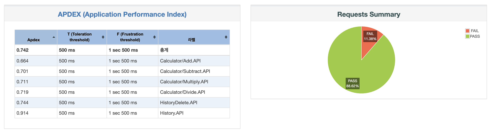
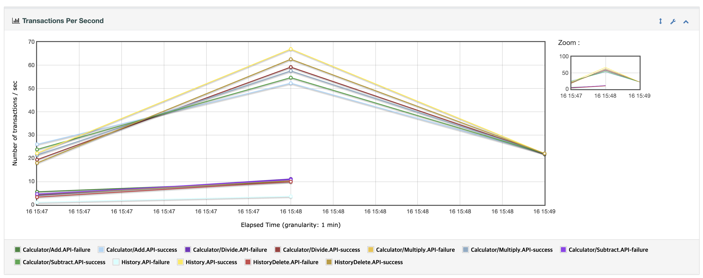
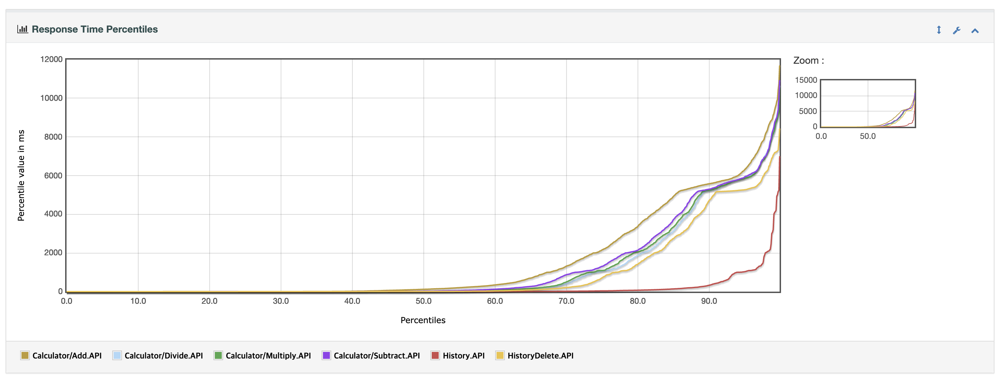

# JMeterTest를 이용한 부하 테스트
---------------------------------------------
- 설치 명령어 : brew install jmeter
- 실행 명령어 : open /opt/homebrew/bin/Jmeter
---------------------------------------------
- 테스트 결과
 
 
 
